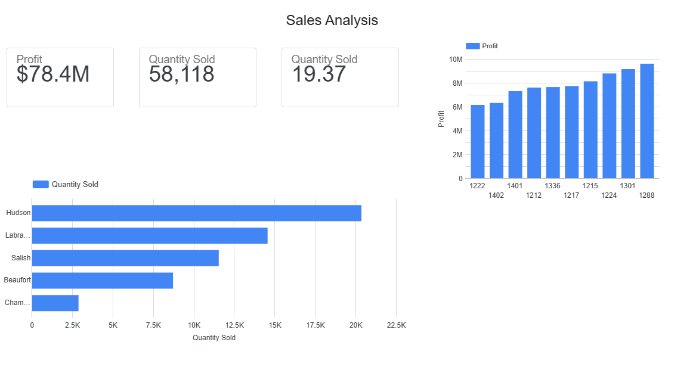
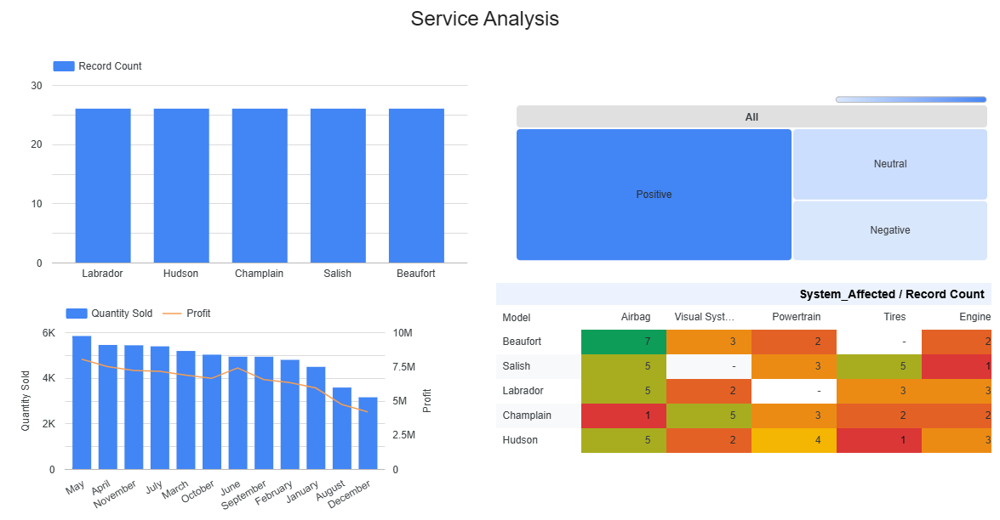

# Automotive Sales & Service Analysis

## Project Overview
This project analyzes automotive sales performance and service insights using Excel and Google Looker Studio.

The project includes sales analysis, dealer performance evaluation, customer sentiment analysis, and vehicle recall analysis through interactive dashboards.

## Tools Used

- Microsoft Excel
- Pivot Tables and Pivot Charts
- Google Looker Studio
- Data Visualization
- Business Analytics

## Project Objectives

- Analyze vehicle sales performance.
- Evaluate dealer profitability.
- Identify sales trends.
- Analyze customer sentiment.
- Monitor vehicle recall patterns.
- Create interactive dashboards for business insights.

## Project Files

- `CarSalesByModelEnd.xlsx`  
  Final Excel analysis including charts and data visualizations.

- `images/`  
  Contains screenshots of the Sales and Service dashboards.

- `data/`  
  Contains the original datasets used for the analysis.

- `documentation/`  
  Contains project documentation files.

## Dashboards

### Sales Analysis Dashboard

Includes:
- Sales performance KPIs.
- Quantity sold analysis.
- Dealer profitability analysis.
- Model sales comparison.

### Service Analysis Dashboard

Includes:
- Vehicle recall analysis.
- Customer sentiment analysis.
- Monthly sales and profit comparison.
- Recall analysis by model and affected system.

## Learning Context

This project was completed as part of the IBM Data Analyst Professional Certificate.

The project demonstrates skills in:
- Data cleaning and preparation.
- Data visualization.
- Dashboard creation.
- Business data analysis.

## Dashboard Preview

### Sales Analysis Dashboard

### Service Analysis Dashboard

## Files

- Excel Analysis: `CarSalesByModelEnd.xlsx`
- Dashboard Report: `Sales_Service_Dashboard.pdf`